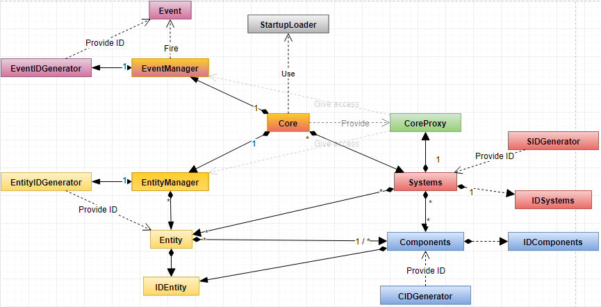

## Global overview

## Core

This class acts as a system manager. It loads and creates systems from shared
libraries. It also manages the execution of all the systems.
It embed also managers for the Entities and for the Events. This composition
allows the use of several Core in the same program which share loaded system.
However each Core may have different loaded systems.

## CoreProxy

This class is a Proxy class of Core. All systems **MUST** use this class if they
need to interact with anything related to the ECS. It exposes methods related to
the creation and destruction of Event or Entities, adding and removing Systems.

## Entity

An Entity is simply a Component container. It checks that there is duplicated
component.

## Component

A Component holds data that determine what an Entity is. It can be identified
through an ID. Its data *should* only be modified by a System. It also holds the
ID of the Entity that owns the Component.

## System

A System is a class that *should* apply only 1 logic of the program. It can
register entities and/or components then apply its logic on them.

## EManager

This class handles anything related to Event. It broadcast Events to all Systems
that has been registered.
A System is automatically registered into the manager when:
  * it inherits from `IEListener`
  * its method `isListener()` should return `true`.

## EntityManager

This class manages anything related to Entities (creation, destruction,
register in system).

## CRTPS / CRTPC / CRTPE

Those class templates are helpers that implements some methods of their
respective interface (IS / IC / IE).

## SIDGenerator / CIDGenerator / EIDGenerator / EntityIDGenerator

Those class are the default ID generator included with this ECS. They can
be replaced by user-defined ID generator without the need of modifying how the
user check its objects type.

## StartupLoader (Will be replaced by an interface)

Load all the systems written on the file it was given and transfer the result to
the Core.
